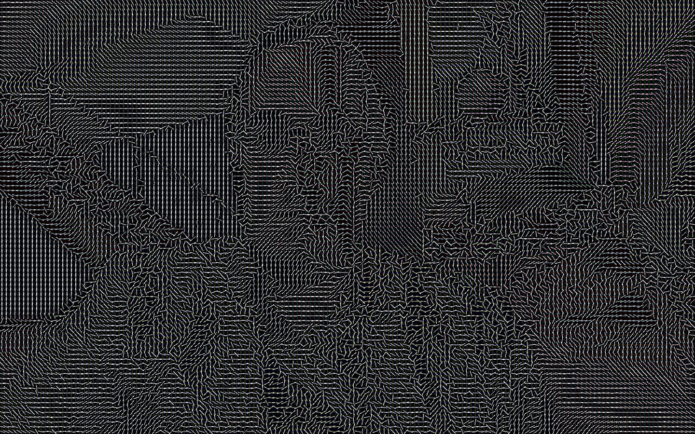
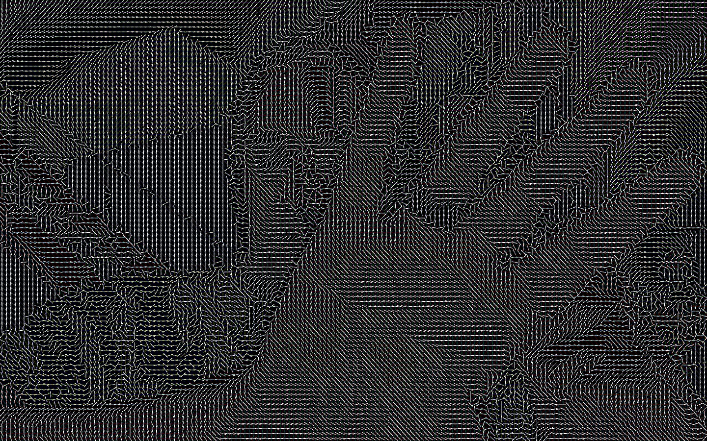

# Magnetic Video
This simple processing sketch grabs frames from your webcam to create a video effect that resembles iron filings under a magnet. Based on the luminance and brightness of each "sample point" in the video, a "/" shape is drawn to the screen.

At the same time, a bunch of tone generators are watching those slashes, changing their pitch in response to how large the deflection angle is for a group of them (by default, there's one tone generator for every 640 "/"s). This is a very "lo-fi", grungy sort of sound. Sometimes it sounds almost like babbling.

The results can be a little odd, but interesting.

## Screen Shots:

## Using

There's no UI. The MagneticVideo.pde tab contains all of the constants that you can tweak to change the behavior of the application. Cells manages the list of Cells and Tones, Cell is the bit that renders a "/", and Tone is the bit that makes noise. The connections between them all are pretty straight-forward.